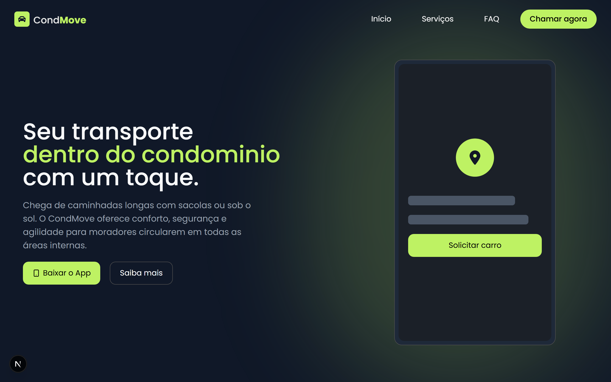

Landing Page desenvolvida com Next.js, TypeScript e TaiwlindCSS. Com foco em **performance, velocidade e experiência de desenvolvimento**.


## Visão Geral

- **Hero**
- **Metricas**
- **Destaques**
- **Fequently Asked Questions (FAQ)**

###


## Tecnologias utilizadas

<div align="left">
  
  
  
  
  
  
  
  
  
  
</div>

###

## Estrutura do projeto

```
Droppe
├── assets
├── eslint.config.mjs
├── next-env.d.ts
├── next.config.ts
├── package-lock.json
├── package.json
├── postcss.config.mjs
├── README.md
├── src
│   ├── app
│   ├── components
│   ├── lib
│   ├── public
│   └── services
└── tsconfig.json


```
